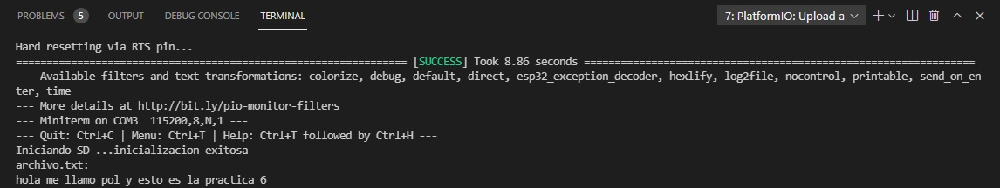

Pol Naharro
## PRACTICA 6 : Buses de comunicación II (SPI)
##### Ejercicio Practico 1 LECTURA/ESCRITURA DE MEMORIA SD

##### Código 

```
#include <Arduino.h>
#include <SPI.h>
#include <SD.h>

File myFile;

void setup()
{
  Serial.begin(115200);
  Serial.print("Iniciando SD ...");
  SPI.begin(18,19,23,5);
  if (!SD.begin(5)) {
    Serial.println("No se pudo inicializar");
    return;
  }
  Serial.println("inicializacion exitosa");
 
  myFile = SD.open("/archivo.txt");//abrimos  el archivo 
  if (myFile) {
    Serial.println("archivo.txt:");
    while (myFile.available()) {
    	Serial.write(myFile.read());
    }
    myFile.close(); //cerramos el archivo
  } else {
    Serial.println("Error al abrir el archivo");
  }
}

void loop()
{
  
}
```
##### Explicación:

El objetivo de esta práctica es abrir un fichero que se encuentra en una SD.
Para ello primero creamos un fichero que llamemos myFile y, luego, iniciamos con el setup y realizamos la instrucción begin del Serial i la SPI. 
```
Serial.begin(115200); SPI.begin(18,19,23,5);
``` 
A continuación hacemos un if para mandar error si la SD no se puede inicializar. Si no enviará un mensaje de éxito.
```
if (!SD.begin(5)) {
    Serial.println("No se pudo inicializar");
    return;
}
Serial.println("inicializacion exitosa");
``` 
Luego abrimos el archivo con la instrucción "myFile = SD.open("/archivo.txt");". Y abrimos el archivo y sacamos por pantalla lo que contiene y luego cerramos.
```
if (myFile) {
    Serial.println("archivo.txt:");
    while (myFile.available()) {
    	Serial.write(myFile.read());
    }
    myFile.close(); //cerramos el archivo
}
``` 
Por último indicamos que hay un error si es que el if falla.

```
else {Serial.println("Error al abrir el archivo");}
```

##### Funcionamiento de la práctica:

Comprobación:


